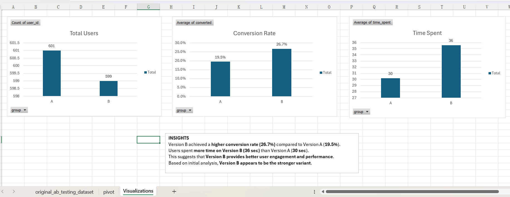

# A/B Testing Analysis for Landing Page Optimization

## 📌 Project Overview
This project evaluates the performance of two landing page variants (Version A and Version B) to determine which one drives better user conversion and engagement. Using Excel, I analyzed user behavior, calculated conversion rates, compared average time spent, and performed hypothesis testing to validate whether the observed improvement was statistically significant.

---

## 🎯 Business Problem
An e-commerce company introduced a new landing page (Version B) and wanted to determine whether it performed better than the existing landing page (Version A). The objective was to identify which version led to higher user conversion and stronger engagement.

---

## 🎯 Objective
- Compare Version A vs Version B
- Measure conversion performance
- Analyze user engagement
- Validate findings using hypothesis testing
- Recommend the better-performing version

---

## 🛠️ Tools Used
- Excel
  - Pivot Tables
  - Charts
  - IF Formula
  - T.TEST
- A/B Testing
- Hypothesis Testing
- Business Analysis

---

## 📂 Dataset Details
The dataset contains user-level interaction data for an A/B test.

### Columns Used:
- `user_id` → Unique user identifier
- `group` → A = old landing page, B = new landing page
- `converted` → 1 = converted, 0 = not converted
- `time_spent` → Time spent on page (seconds)

### Dataset Size:
- 1,200 rows
- 2 groups: A and B

---

## 🔍 Key Business Questions
1. Which landing page version has the higher conversion rate?
2. Which version keeps users engaged longer?
3. Is the difference statistically significant?
4. Which version should the business implement?

---

## 📊 Results

| Metric | Version A | Version B |
|--------|-----------|-----------|
| Conversion Rate | 19.5% | 26.7% |
| Avg. Time Spent | 30 sec | 36 sec |

---

## 🧪 Hypothesis Testing

### Null Hypothesis (H₀)
There is no significant difference between Version A and Version B.

### Alternative Hypothesis (H₁)
Version B performs better than Version A.

### Test Used
Excel `T.TEST`

### p-value
`0.002883`

### Interpretation
Since `0.002883 < 0.05`, the result is statistically significant.

This means the improvement in Version B is real and not due to random chance.

---

## 💡 Key Insights
- Version B achieved a higher conversion rate than Version A.
- Users spent more time on Version B, indicating stronger engagement.
- The performance improvement was statistically significant.
- Version B is recommended for implementation.

---

## ✅ Final Recommendation
Based on the analysis, Version B should be implemented. It delivered higher conversion performance, stronger user engagement, and statistically significant improvement over Version A.

---

## 📸 Dashboard Preview

---

## 👩‍💻 Author
**Sakshi Sidharam Whandre**
- LinkedIn: www.linkedin.com/in/sakshi-whandre-8a685a227